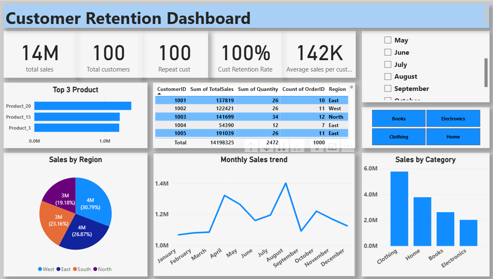

# 📊 Customer Retention & Sales Analysis Dashboard

## 🔍 Overview
This project focuses on analyzing customer retention and sales performance by combining SQL, Excel, and Power BI. The goal was to validate raw data, ensure data integrity, and transform it into actionable business insights through an interactive dashboard.

---

## 🎯 Problem Statement
Businesses often face challenges in validating raw data, understanding customer retention, and analyzing sales performance across regions and product categories.

This project aims to solve these challenges by using SQL for data validation and analysis, followed by building a Power BI dashboard to visualize key insights.

---

## 🛠️ Tools & Technologies Used
- SQL (MySQL) – Data validation, aggregation, and analysis  
- Microsoft Excel – Data cleaning & preprocessing  
- Power BI – Dashboard development & visualization  
- DAX – KPI calculations and measures  
- Data Analysis – Customer behavior & trend analysis  

---

## 📊 SQL Analysis Highlights
- Performed data validation checks (null values, duplicates, integrity)
- Verified relationships between customers, orders, and products
- Calculated total sales using aggregation queries
- Identified top-performing products using JOIN operations
- Analyzed customer order frequency and repeat customers
- Generated sales insights by region and category

---

## 📊 Key Features of Dashboard
- KPI cards for Total Sales, Customers, and Retention Rate
- Analysis of Repeat Customers
- Sales distribution by Region
- Monthly Sales Trend visualization
- Top Products performance
- Category-wise Sales analysis
- Interactive filters for Month and Category

---

## 📈 Key Insights
- Total Sales reached approximately **14M**
- Customer Retention Rate is **100%**, indicating strong loyalty or dataset limitation
- West region contributes the highest sales (~30%)
- Clothing category dominates revenue (~6M)
- Top products generate a significant portion of total sales
- Sales show seasonal trends with peaks in **August–September**

---

## 📁 Dataset & Files
- 📄 Sales Dataset (Excel)
- 📊 Power BI Dashboard (.pbix file)
- 🧾 SQL Script (Data Validation & Analysis)
- 📸 Dashboard Screenshots

---

## 📸 Dashboard Preview

---

## 🚀 Project Outcome
This project demonstrates my ability to:
- Validate and clean data using SQL
- Perform data analysis using structured queries
- Build interactive dashboards using Power BI
- Analyze customer retention and sales trends
- Communicate insights effectively for business decisions

---

## 👨‍💻 Author
**Aditya Jadaun**  
Aspiring Data Analyst  

---

## 📬 Let's Connect
I am actively looking for Data Analyst opportunities.

- LinkedIn: (https://www.linkedin.com/in/aditya-rajput-humanbeing/)
- GitHub: (https://github.com/humanadityajadaun)

---

⭐ If you found this project useful, feel free to star this repository!
